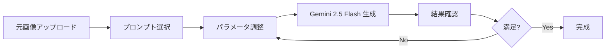

# Gemini 2.5 Flash (nano banana) プロンプト集

## 📚 公式リファレンス

### Google 公式
- **テンプレート**: https://ai.google.dev/gemini-api/docs/image-generation?hl=ja#template
- **Gemini 公式 Note**: https://note.com/google_gemini/n/n1afcbf4d5275

### コミュニティリソース
- **Awesome Nano Banana Image（参考事例多数）**: https://github.com/PicoTrex/Awesome-Nano-Banana-images/blob/main/README_ja.md

---

## 🎨 プロンプトテンプレート集

### 1. PVC フィギュア化プロンプト

**用途**: 写真からリアルな PVC 製フィギュアを生成

```yaml
prompt: |
  Create a high-quality PVC statue of the person in the reference photo. This statue reproduces the person's form from the waist up. "Reconstruct it with an emphasis on the details of a PVC statue, rather than simply miniaturizing a photograph."
  "The hair must not be reproduced as individual strands." Emphasize the expression of planes, as a "sculpted mass." It should be composed of a "natural flow of three-dimensional hair constructed from planes, solid hair clumps, and a well-defined planar structure." And prioritize a beautiful balance of shadow and highlight that emphasizes the hair is made of PVC.
  The skin should lack realistic pores and have a smooth, airbrushed finish with the subtle satin sheen characteristic of PVC. Please add subtle parting lines (seam lines) that would occur during the manufacturing process.
  The statue must be placed large and in the center of the frame.
  The statue is mounted on a sleek, circular, matte silver metallic base and is carefully held in the center of the frame by a person's hands. The background is a textured beige wall. The statue is illuminated by dramatic lighting, shot with a shallow depth of field, with a tack-sharp focus on the PVC statue itself.

features:
  - 細部まで PVC 化
  - 髪は立体的な面構成
  - 肌は滑らかなエアブラシ仕上げ
  - パーティングライン（成形ライン）を再現
  - ドラマティックなライティング
```

---

### 2. 写真に手書き文字オーバーレイ

**用途**: 写真に自動で手書き風テキストを追加

```yaml
request_type: auto_handwritten_overlay
description: >
  Automatically applies a handwritten paint effect to an uploaded image.
  The AI analyzes the image's subject and mood to determine the style,
  color, and content of the handwritten elements without explicit user input
  beyond the image itself.

generated_prompt: |
  A photograph of [auto_detected_photo_subject] with a [auto_detected_photo_mood] mood.
  Overlay a handwritten paint effect in a [auto_selected_paint_style] style
  using a [auto_selected_paint_color] color.
  The painted elements will include simple illustrations, shapes, and short text or phrases
  that organically complement the image's detected theme and atmosphere.

features:
  - AI が写真の被写体と雰囲気を自動分析
  - 手書き風ペイント効果を自動適用
  - スタイル、色、内容を自動決定
```

---

### 3. 文字多めファッション誌風カバー

**用途**: 情報密度の高い雑誌カバーを生成（3:4 アスペクト比固定）

```yaml
request_type: generate_hyper_detailed_magazine_cover_with_fixed_aspect_ratio
description: >
  Generates a highly impactful and professionally styled magazine cover based on an uploaded photo,
  **with a significantly increased density of textual and graphic elements to create a 'busy yet cohesive' aesthetic,**
  while consistently maintaining a 3:4 aspect ratio for the final output.

variables:
  - name: input_image
    description: The primary image provided by the user to be used as the magazine cover's base.
    type: image_attachment
  - name: user_prompt_text
    description: Optional text from the user, primarily for general request context.
    type: string
    optional: true

processing_steps:
  - step: 1
    name: "Analyze Image for Core Elements & Mood"
    action: "Automatically analyze `input_image` to identify its main subject, dominant mood/atmosphere, and primary color palette/contrast."

  - step: 2
    name: "Adjust Image to Target Aspect Ratio (3:4)"
    action: "**Crucially, preprocess the `input_image` to fit a 3:4 portrait aspect ratio.**"
    details:
      - "If the original image is not 3:4, intelligently crop or resize the image, ensuring the main subject remains prominent and compositionally strong."
      - "If cropping/resizing alone is insufficient, **AI must generate and seamlessly extend the background of the original image to fill the 3:4 frame.**"

  - step: 3
    name: "Auto-Generate Impactful Main Title (Bold & Integrated)"
    action: "Coin an optimal, exceptionally catchy, and highly impactful English main title for the magazine cover."
    details:
      - "Select extremely bold, high-contrast, and dynamic typography."
      - "Examples: 'URBAN FUSION', 'VIVID HORIZON', 'ICONIC PRESENCE', 'NEO GENESIS', 'ELEVATE', 'THE EDGE', 'STYLE REVOLUTION'"

  - step: 4
    name: "Auto-Generate Hyper-Dense Subtitles & Ancillary Text (Busy & Detailed)"
    action: "**Generate a multitude of diverse English subtitles, feature headlines, mini-column mentions, short lead-in sentences, and impactful quotes.**"
    details:
      - "Employ a rich variety of font styles, sizes, and weights."
      - "Integrate realistic magazine elements: feature headlines, publication date (e.g., 'DECEMBER 2024'), price (e.g., '£5.99 / $8.99'), publisher logo, barcode, website URL, social media handles."

  - step: 5
    name: "Achieve Maximum Text-Image Fusion & Professional, Dense Layout"
    action: "Integrate all elements to form an exceptionally cohesive, professional magazine cover."
    details:
      - "Ensure text interacts deeply with the image, appearing to wrap around or emerge from the main subject."
      - "The layout should be densely packed with information, creating a 'busy yet cohesive' aesthetic."

generation_output:
  format: image
  aspect_ratio: "3:4"
  description: >
    A highly professional magazine cover with bold main titles, dense array of subtitles,
    and ancillary magazine texts, creating a 'busy yet cohesive' aesthetic.

features:
  - 3:4 アスペクト比固定
  - 情報密度が非常に高い
  - プロフェッショナルなレイアウト
  - リアルな雑誌要素（価格、バーコード、URL等）
```

---

### 4. モダン風雑誌カバー（Bauhaus グリッド）

**用途**: Swiss Design / Bauhaus 原則に基づいた高級ファッション誌風カバー

```yaml
request_type: generate_high_fashion_magazine_cover_with_bauhaus_grid
description: >
  Generate a high-fashion magazine cover based on the uploaded photo, strictly following
  Swiss Design / Bauhaus grid principles. The grid is used as an invisible structural
  system for precise placement of all elements, not as a visible graphic accent.
  The cover should be monochrome-based with one single accent color, chosen automatically
  to harmonize with the photo's tone and background.
  The final output must look like a realistic commercial magazine cover, inspired by the editorial
  aesthetics of **Vogue, i-D, and Numero**: refined, minimal, and fashion-forward.

variables:
  - name: input_image
    description: The main photo provided by the user
    type: image_attachment
  - name: user_prompt_text
    description: Optional text for contextual adjustment
    type: string
    optional: true

processing_steps:
  - step: 1
    name: "Image Analysis & Tone Extraction"
    action: "Analyze `input_image` to detect subject, tonal balance, and mood."
    details:
      - "Determine the most appropriate single accent color that harmonizes with the image."
      - "Maintain a monochrome base; never apply more than one accent color."

  - step: 2
    name: "Aspect Ratio Adjustment"
    action: "Resize or extend `input_image` to exactly 3:4 portrait ratio."

  - step: 3
    name: "Main Title Placement (CURVE)"
    action: "Render the main title text 'CURVE' occupying approximately 25% of the vertical space."
    details:
      - "Always positioned behind the subject to create depth."
      - "Tightly kerned letterspacing to emphasize geometric, bold form."
      - "Snap the baseline of the text precisely to the grid structure."

  - step: 4
    name: "Subtitle and Issue Information"
    action: "Integrate secondary typographic elements with clarity and restraint."
    details:
      - "Subtitle 'Modernism' placed right-aligned beneath the title."
      - "'001 Issue' enclosed in a 1px black circular outline, positioned at the bottom-right grid corner."

  - step: 5
    name: "Grid-Constrained Integration"
    action: "Unify all elements under a strict invisible grid system."
    details:
      - "Use a modular grid with 6–12 divisions for alignment."
      - "Respect equal margins on all sides."
      - "No decorative motifs, visible gridlines, or unnecessary icons allowed."

generation_output:
  format: image
  aspect_ratio: "3:4"
  description: >
    A realistic, commercial-grade high-fashion magazine cover in the editorial style of **Vogue, i-D, and Numero**.
    The title 'CURVE' is bold, kerned, and positioned behind the subject.
    Subtitle 'Modernism' is right-aligned beneath the title, and '001 Issue' appears in a thin 1px black circle.
    The entire layout follows a strict 6–12 module Swiss/Bauhaus grid system.

features:
  - Swiss Design / Bauhaus グリッド原則準拠
  - モノクローム + 1 色のアクセントカラー
  - Vogue、i-D、Numero 風の洗練された美学
  - 見えないグリッド構造による精密配置
```

---

### 5. イラスト→ポップアップストア風

**用途**: イラストをグッズ化し、ポップアップストア内に配置

```yaml
prompt: |
  Illustration Processing:
  The background is removed, and the characters are transformed into figurines and merchandise.

  Quality/Expression:
  Photorealistic. Detail is meticulously rendered. A realistic sheen and urban atmosphere, with a subtle fancy pop-up store vibe in pastel tones and playful decorations.

  Location:
  Inside a limited-time fancy pop-up event store.

  Main Subject:
  A 1m tall deformed character figure is placed at the store entrance, surrounded by event banners, balloons, and decorative signs that emphasize the limited-time nature of the shop.

  Inside the store, character posters, figurines, dolls, plush toys, keychains, mugs, and T-shirts are displayed on temporary event shelves, pop-up showcases, and racks with "Limited Collaboration" tags.

  "Collaboration" panels installed above and around the counter area, featuring colorful pastel pop-up store designs highlighting exclusive character goods.

  Display/Presentation:
  Character advertisements and anime videos are shown on LCD displays inside the store, with bright and cheerful effects.

  Limited-edition packaging, decorative props, pop-up shop signs, and event-style displays create a festive, exclusive, and time-limited atmosphere.

  Angle/Camera:
  A low angle emphasizes the sign and the area around the counter.

  Resolution/Aspect Ratio:
  4K, 4:3

features:
  - イラストの背景を削除してグッズ化
  - フォトリアルな表現
  - パステルトーンのポップアップストア
  - 限定コラボグッズの演出
  - LCD ディスプレイでキャラクター映像表示
  - ローアングルでカウンター周辺を強調
```

---

### 6. イラスト→ポップアップストアビル（大規模）

**用途**: 大型キャラクターオブジェとコラボストアビルを生成

```yaml
prompt: |
  Illustration Processing:
  The background is removed and the characters are transformed into figurines and merchandise.

  Character:
  A character cosplayer is placed in the center of the store.
  Realistic and detailed representation.

  Figure/Object:
  A large, elaborate, 3m-tall character object is installed in front of the store (an elaborate object like a figurine with an impressive presence).

  Location: Corner of the intersection at the foot of Tokyo Tower.
  Angle from the front of the store.

  Store Exterior:
  Countless LED advertising panels on the exterior walls (playing character promotional videos).
  An urban, glamorous atmosphere.

  Store Interior/Exhibits:
  A luxurious building.
  Pop-up event style featuring limited collaboration goods:
  - Figures
  - Dolls
  - Plushies
  - Keychains
  - Mugs
  - T-shirts
  Fixtures and event shelves with "Limited Collaboration" tags
  Collaboration panels installed around the counter inside the store

  Display/Production:
  Character videos on LCD and LED screens inside and outside the store
  Glamorous, limited-time decorations (balloons, signs, billboards)

  Camera/Angle:
  Frontal angle + slightly low angle
  Composition highlighting the entire store, cosplayers, large figures, and LED advertisements

  Quality/Expression:
  Photorealistic
  Precise depiction of details
  Realistic gloss and urban atmosphere

  Resolution/Aspect Ratio:
  4K, 4:3

features:
  - 東京タワー近くの交差点という具体的ロケーション
  - 3m の大型キャラクターオブジェ
  - 外壁に無数の LED 広告パネル
  - コスプレイヤーを店舗中央に配置
  - 都会的でグラマラスな雰囲気
  - フロント + ローアングルの構図
```

---

## 🎯 使用ガイドライン

### 基本原則

1. **詳細な指示**: Gemini 2.5 Flash (nano banana) は詳細なプロンプトに強い
2. **構造化**: YAML 形式で段階的に指示を整理
3. **具体性**: "photorealistic", "4K", "3:4 aspect ratio" など明確に指定
4. **レイヤー指示**: 背景、被写体、テキスト、装飾を分けて記述

### プロンプト設計のコツ

- **Step-by-Step**: 処理ステップを明確に分割
- **Quality Specification**: 画質、解像度、アスペクト比を明示
- **Style Reference**: Vogue、i-D など具体的な参照を提示
- **Technical Details**: PVC の質感、グリッドシステムなど技術的詳細を記述

### 推奨ワークフロー



---

## 📊 パフォーマンス指標

### 生成品質目標

| 項目 | 目標 |
|------|------|
| 解像度 | 4K (3840x2160) |
| アスペクト比 | 3:4 (ポートレート) or 4:3 |
| リアリズム | Photorealistic |
| 詳細度 | Meticulously detailed |

### 用途別推奨プロンプト

| 用途 | 推奨プロンプト |
|------|--------------|
| フィギュア生成 | PVC フィギュア化 |
| 雑誌カバー（情報密度高） | 文字多めファッション誌 |
| 雑誌カバー（ミニマル） | モダン風雑誌（Bauhaus） |
| イラストのグッズ化 | ポップアップストア風 |
| 大規模コラボ演出 | ポップアップストアビル |

---

## 🔧 カスタマイズ例

### プロンプトの拡張方法

```yaml
# ベースプロンプトに追加可能な要素
additional_elements:
  lighting:
    - "dramatic lighting"
    - "soft diffused light"
    - "golden hour lighting"

  camera:
    - "shallow depth of field"
    - "wide angle"
    - "macro lens"

  mood:
    - "urban atmosphere"
    - "elegant and refined"
    - "playful and energetic"

  details:
    - "tack-sharp focus"
    - "meticulously rendered details"
    - "realistic sheen"
```

---

## 📝 メンテナンス履歴

- **2025-10-17**: 初版作成 - 6 種類のプロンプトテンプレートを追加
- 今後の追加予定:
  - アニメーション風プロンプト
  - 3D レンダリング風プロンプト
  - コンセプトアート風プロンプト

---

## 🔗 関連ドキュメント

- [GEMINI.md](./GEMINI.md) - Gemini API 統合ガイド
- [README.md](../README.md) - プロジェクト全体概要
- [CLAUDE.md](../CLAUDE.md) - Claude Code コンテキスト

---

*このドキュメントは Gemini 2.5 Flash (nano banana) 機能を最大限活用するためのプロンプト集です。*
*モデル名: `models/gemini-2.5-flash-image`*
*新しいプロンプトパターンを発見した際は、このドキュメントに追加してください。*
