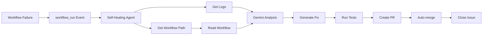

# 🔧 Self-Healing Agent

**ワークフロー障害を自動修復する自律型 Agent**

Self-Healing Agent は GitHub Actions ワークフローの失敗を検知し、AI を活用して自動的に修復する完全自律型のシステムです。

## 📋 目次

- [概要](#概要)
- [アーキテクチャ](#アーキテクチャ)
- [セットアップ](#セットアップ)
- [使用方法](#使用方法)
- [トラブルシューティング](#トラブルシューティング)
- [開発者向け情報](#開発者向け情報)

## 概要

### 主な機能

#### 🚨 自動エラー検知
- 監視対象ワークフローの失敗を自動検知
- GitHub Actions の `workflow_run` イベントを使用
- 失敗時に即座に Self-Healing Agent が起動

#### 🔍 AI エラー分析
- Gemini AI がワークフローログを解析
- エラーの根本原因を特定
- 依存関係、設定ミス、コードバグを判定

#### 🛠️ 自動修復
- 修復コードを自動生成
- TypeScript strict mode 準拠
- 最小限の変更で修復

#### ✅ 自動マージ
- テスト実行後に自動マージ
- Draft PR → Auto-merge 設定
- 失敗時は手動レビュー要求

#### 📊 Issue 自動管理
- 失敗検知時に Issue を自動作成
- PR 作成後に Issue をクローズ
- 全プロセスを追跡可能

### 監視対象ワークフロー

Self-Healing Agent が監視するワークフロー:

1. **Test Self-Healing Agent** - Self-Healing Agent 自身のテスト
2. **Gemini CLI - AI Code Assistant** - Gemini CLI 統合
3. **Webhook Event Handler** - Webhook イベント処理
4. **Autonomous Agent Execution** - 自律型 Agent 実行
5. **State Machine Automation** - ステートマシン自動化
6. **Economic Circuit Breaker** - コスト監視

## アーキテクチャ

### ワークフロー構造

```
ワークフロー失敗
    ↓
Self-Healing Agent 起動
    ↓
1. ワークフローファイルパス取得
    ↓
2. ワークフローログ取得
    ↓
3. Issue 作成
    ↓
4. ワークフローファイル読み込み
    ↓
5. Gemini AI でエラー分析・修復
    ↓
6. 依存関係インストール
    ↓
7. 型チェック・テスト実行
    ↓
8. Pull Request 作成
    ↓
9. Auto-merge 設定
    ↓
10. Issue クローズ
```

### コンポーネント構成

```
.github/workflows/
├── self-healing.yml              # メインワークフロー
└── test-self-healing-scripts.yml # テストワークフロー

scripts/self-healing/
├── get-workflow-path.sh          # ワークフローファイル検索
├── get-workflow-logs.sh          # ログ取得
└── read-workflow.sh              # ワークフローファイル読み込み

tests/self-healing/
├── get-workflow-path.bats        # 単体テスト
├── get-workflow-logs.bats        # 単体テスト
└── read-workflow.bats            # 単体テスト
```

### データフロー



詳細: [ARCHITECTURE.md](./ARCHITECTURE.md)

## セットアップ

### 前提条件

- GitHub リポジトリ（Public または Private）
- GitHub Actions 有効
- Gemini API キー（無料）

### 必要な Secrets

GitHub リポジトリの Settings → Secrets → Actions に以下を追加:

#### 1. GEMINI_API_KEY（必須）

```bash
# Google AI Studio で取得
# https://ai.google.dev/gemini-api/docs/api-key

Name: GEMINI_API_KEY
Value: (あなたの Gemini API キー)
```

#### 2. PAT_TOKEN（推奨）

```bash
# Personal Access Token (classic)
# https://github.com/settings/tokens

Name: PAT_TOKEN
Scopes:
  - repo (Full control of private repositories)
  - workflow (Update GitHub Action workflows)
  - write:discussion (Write discussion)

Value: (あなたの Personal Access Token)
```

> **注**: `PAT_TOKEN` がない場合は `GITHUB_TOKEN` を使用しますが、一部機能が制限されます。

### ワークフローファイルの配置

`.github/workflows/self-healing.yml` をリポジトリに配置:

```bash
# リポジトリルートで実行
git add .github/workflows/self-healing.yml
git commit -m "feat: Add Self-Healing Agent"
git push origin main
```

### 権限設定

`.github/workflows/self-healing.yml` の permissions を確認:

```yaml
permissions:
  contents: write      # コード変更用
  issues: write        # Issue 作成・クローズ用
  pull-requests: write # PR 作成用
  actions: write       # ワークフロー実行用
```

## 使用方法

### 基本的な流れ

1. **監視対象ワークフローが失敗**
   - 自動的に Self-Healing Agent が起動

2. **Issue 作成**
   - タイトル: `🚨 Self-Healing: [ワークフロー名] failure`
   - エラー詳細が自動記載

3. **自動修復**
   - Gemini AI がエラーを分析
   - 修復コードを生成

4. **PR 作成**
   - タイトル: `fix: Auto-heal [ワークフロー名] (#Issue番号)`
   - Draft PR として作成

5. **自動マージ**
   - テスト通過後に自動マージ
   - Issue を自動クローズ

### 手動実行

必要に応じて手動で実行可能:

```bash
# GitHub UI から実行
# Actions → 🔧 Self-Healing Agent → Run workflow
```

### ログの確認

```bash
# Self-Healing Agent のログを確認
gh run list --workflow=self-healing.yml

# 特定の run のログを表示
gh run view <run_id> --log
```

## トラブルシューティング

### よくある問題と解決方法

詳細: [TROUBLESHOOTING.md](./TROUBLESHOOTING.md)

#### 1. Self-Healing Agent が起動しない

**症状**: ワークフローが失敗しても Self-Healing Agent が実行されない

**原因と解決方法**:

```bash
# 1. workflow_run トリガーの設定確認
# .github/workflows/self-healing.yml の on.workflow_run.workflows を確認

# 2. ワークフロー名が一致しているか確認
gh api /repos/{owner}/{repo}/actions/workflows | jq '.workflows[].name'

# 3. permissions が正しく設定されているか確認
# contents: write, issues: write, pull-requests: write, actions: write
```

#### 2. Gemini API エラー

**症状**: `Failed to analyze with Gemini` エラー

**原因と解決方法**:

```bash
# 1. GEMINI_API_KEY が設定されているか確認
gh secret list

# 2. API キーが有効か確認
curl -H "Content-Type: application/json" \
  -d '{"contents":[{"parts":[{"text":"test"}]}]}' \
  "https://generativelanguage.googleapis.com/v1beta/models/gemini-pro:generateContent?key=YOUR_API_KEY"

# 3. API レート制限を確認
# 無料枠: 60 requests/min, 1,000 requests/day
```

#### 3. PR 作成に失敗

**症状**: `Failed to create pull request` エラー

**原因と解決方法**:

```bash
# 1. PAT_TOKEN が設定されているか確認
gh secret list

# 2. PAT_TOKEN のスコープを確認
# repo, workflow, write:discussion が必要

# 3. ブランチ保護ルールを確認
gh api /repos/{owner}/{repo}/branches/main/protection

# 4. 代替策: GITHUB_TOKEN を使用（一部機能制限あり）
```

#### 4. テストが失敗して自動マージされない

**症状**: PR は作成されるが Auto-merge されない

**原因と解決方法**:

```bash
# 1. テスト結果を確認
gh pr checks <pr_number>

# 2. 型エラーがないか確認
npm run typecheck

# 3. テストがパスするか確認
npm test

# 4. 修復コードを手動でレビュー
gh pr view <pr_number> --web
```

## 開発者向け情報

### スクリプトのテスト

```bash
# 全テスト実行
bats tests/self-healing/*.bats

# 特定のテストファイルのみ
bats tests/self-healing/get-workflow-path.bats

# カバレッジレポート
cat tests/self-healing/COVERAGE_REPORT.md
```

### ローカルでのデバッグ

```bash
# スクリプトを個別に実行
export GITHUB_OUTPUT=/tmp/test-output.txt

bash scripts/self-healing/get-workflow-path.sh "Test Workflow"
cat /tmp/test-output.txt

bash scripts/self-healing/get-workflow-logs.sh "12345" "owner/repo"
cat /tmp/test-output.txt
```

### 新しいワークフローの監視対象追加

`.github/workflows/self-healing.yml` の `on.workflow_run.workflows` に追加:

```yaml
on:
  workflow_run:
    workflows:
      - "Test Self-Healing Agent"
      - "Gemini CLI - AI Code Assistant"
      - "Your New Workflow Name"  # ← 追加
    types: [completed]
```

> **重要**: ワークフロー名は `.github/workflows/*.yml` の `name:` フィールドと正確に一致する必要があります。

### テストカバレッジ

現在のカバレッジ: **100%** ✅

- `get-workflow-path.sh`: 5 tests
- `get-workflow-logs.sh`: 7 tests
- `read-workflow.sh`: 6 tests

詳細: [tests/self-healing/COVERAGE_REPORT.md](../../tests/self-healing/COVERAGE_REPORT.md)

## 参考資料

- [GitHub Actions workflow_run イベント](https://docs.github.com/en/actions/using-workflows/events-that-trigger-workflows#workflow_run)
- [Gemini API ドキュメント](https://ai.google.dev/gemini-api/docs)
- [google-github-actions/run-gemini-cli](https://github.com/google-github-actions/run-gemini-cli)
- [peter-evans/create-pull-request](https://github.com/peter-evans/create-pull-request)

## ライセンス

MIT

---

🔧 **Self-Healing Agent** - Powered by Google Gemini AI
